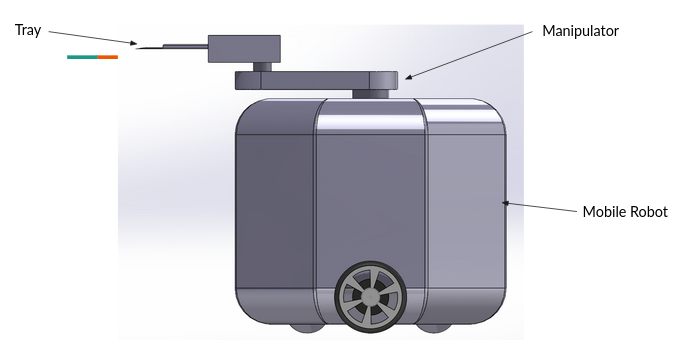

# Manipulatie-Wheeled-Robot-for-Hospitality-Industry
Serve in restraunts

## Overview
These kinds of robots are very efficient and convenient during the covid times without much human intervention, which will deliver the food from the kitchen to the table. This ensures the hygiene of the food and safety of the customers. 

There are many applications instead of serving food, including but not limited to hospitality, home and the patients with covid positive.  


## Team
* Yashveer Jain
* Rohit Reddy

## installation
```
cd ~/catkin_ws/src
git clone https://github.com/yashveerjain/Manipulative-Wheeled-Robot-for-Hospitality-Industry.git robo9
cd ..
catkin_make
. devel/setup.bash
```
* Note: 
    - Assuming the ROS is already installed and the workspace is already created as `catkin_ws` in home dir.
    - `robo9` is package name and so we are naming it our clone directory.

## Run
* On one terminal
```
roslaunch robo9 robo.launch
```
* On another terminal
```
cd ~/catkin_ws/src
python3 robo9/src/robo_motion_v3_only_arm_ik.py
```

## About Executables:
* robo_motion_v3_only_arm_ik.py
    - Contain inverse kinematics of Manipulator, so Manipulator moves automatically including the arm, end-effector and tray-diffusor.
    - Teleop of moving robot base
    - For moving the manipulator need to give Table number between (1-6)
        - where Tables 1-3 are in right direction of robot
        - and Table 4-6 are in left direction of robot.
* robo_motion.py
    - Operates solely on Teleop keyboard keys.
    - See the message printed on after running to hit right keys
* robo_motion_v2.py
    - Meant to be fully Autonomous, but still work in progress ;)

## Robo Workspace


## Model
Robot modelling is done on solidworks, part and assembly files are present [here](robot_part_files_solidworks/)


## Robo Image



## Depedencies
* ROS - noetic
* python3
* gazebo
* Rviz

## Installing Dependencies for Python
```
pip install -r requirements.txt
```